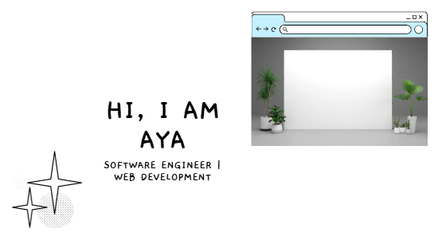

# Hi, I am Aya Othmen  
## Software Engineer | Web Development  
@aya-othmen7  

## About Me
I am a passionate and autonomous Industrial Computer Engineering student at ENET’COM, specializing in web development and industrial automation. I work on diverse web projects, leveraging my skills to optimize processes and drive innovation. Currently, I’m seeking an end-of-studies internship to further enhance my expertise.

Explore my GitHub for projects from summer internships, academic work, and personal initiatives. Feel free to connect with me via my [LinkedIn](https://www.linkedin.com/in/aya-othmen) profile.

[More on Aya's Engineering Journey](#)

## Languages and Tools
  
  
  
  
  
  
  
  
  
  
  
  
  
  
  
  
  <!-- Placeholder, adjust if available -->

## My Projects
- Product Management Interface with Spring Boot - A web-based product management system using Spring Boot and MySQL.
- Excel File Transfer and Processing - Utilized LabVIEW and Google Drive for file manipulation.
- Distributed Book Management System - Built with Java RMI for networked data handling.
- Task Management Web Application - Developed with HTML, CSS, JavaScript, PHP, and MySQL.
- Intelligent Cane for the Visually Impaired - Designed with Arduino and GPS for accessibility.
- Cargo Management Graphic Interface - Created using Java.
- Temperature Control System Simulation - Simulated with Proteus and MPLAB X IDE.

## Languages
- Arabic: Native speaker
- French: B2
- English: B2

## Achievements
- Certificates in web development and industrial automation.
- Organized and participated in IEEE events (TSYP 12, PESTGM 5.0).
<!-- Upload ieee-badge.png to the repository if available -->
